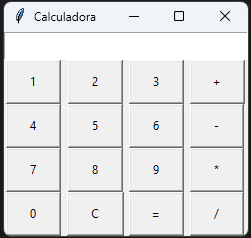

# Aplicativo  

## **Calculadora TKinter**

*Projeto de calculadora com funções básicas*

## Ferramentas

  

 

# Calculadora
 

 

 
 

# Créditos
<table>
  <tr>
    <td align="center">
      <a href="https://github.com/fabriciovale20">
         
        
          <b>Fabrício Vale</b>
        
      </a>
    </td>
  </tr>
</table>
